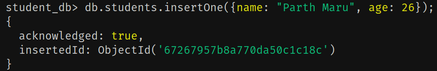
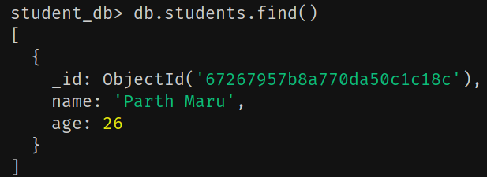
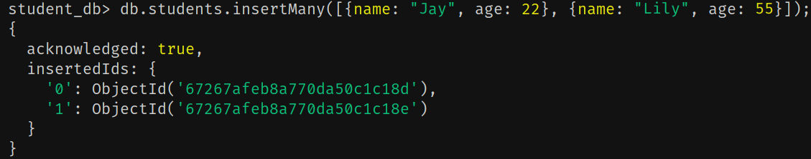
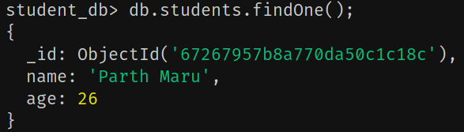
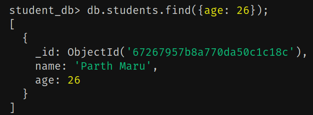
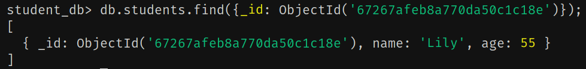
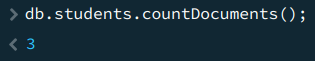
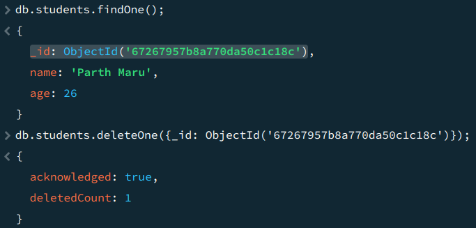
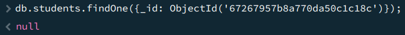

# MongoDB

- It is a NoSQL DB.
- Cross-platform, opensource and document based DB.
- MongoDB stores one record(row) as a document.
- A group of documents belong to a collection.
- For example: Book my show is a database which has many collections such as movies, payments, users, etc.
- Each of these collections has many records called as documents.
- So if we relate with SQL,
  - Table -> Collection
  - Row -> Document
  - Column Name -> Field
- In SQL, every row will have the same number of columns with different values in each cell but that's not the case in MongoDB.
- In MongoDB, each document can have different number of properties.
- MongoDB stores the data in JSON and BSON format.
- Internally it uses BSON and when it loads it, it uses JSON for retrieving it.

```json
// Document 1
{
    name: some_value,
    address: some_value,
    marks: some_value,
    roll_no: some_value
}

// Document 2
{
    name: some_value,
    contact_no: some_value
}
```

- From the above example we see that both the documents not only have different number of fields but also different fields.
- So every document can have its own structure and fields.
- This shows that a mongodb database is highly scalable.
- It has a distributed architecture which makes it easy to deploy on multiple servers and provide a better scalability.

## Features of MongoDB

- Scalable
- Flexible
- High performance
- Suited for wide use cases
- Comparatively easy query language
- Well suited for unstructured data
- Many cloud platforms provide readily support for mongodb

## Using MongoDB

- `mongosh` - MongoDB in terminal
- Compass - GUI client

## MongoDB commands

### Show database

```
show dbs;

show databases;
```

### Using a DB

```
use <db_name>;
```

### Create a new DB

```
use student_db;
```

- This command will use `student_db` db if present.
- But if it does not exists, it will create a new db `student_db` and start using it.
- This newly created db will not be displayed in the list of DB unless there is exists any collection in the DB.

### Show collections

```
show collections;
```

### Create a new collections

```
db.createCollection("courses");
db.createCollection("students");
```

- Now when we try to list the existing DB, `student_db` will also show up.
- Here, `db` refers to the current database being used.

### Display all the documents in a collection

```
db.students.find();
```

- It returns an array of objects (in JS).

### Inserting a document in a collection

```
db.students.insertOne({name: "Parth Maru", age: 26});
```




- A unique id is also generated.
- Every document will have a unique id which is not a incremental id but alphanumeric.

### Inserting multiple documents in a collection

```
db.students.insertMany([{name: "Jay", age: 22}, {name: "Lily", age: 55}]);
```



- We pass an array of objects.

### Filtering records

#### `findOne()`

- Displays the first document.



#### Finding with a particular value



- We pass the key-value pair that we want to find as an argument to `find()`.
- `find()` will always return an array of objects whereas `findOne()` will return a single object.

#### Finding using id



#### Finding the number of documents



### Delete a document




### Delete many docs

```
db.students.deleteMany({key: value});

```
