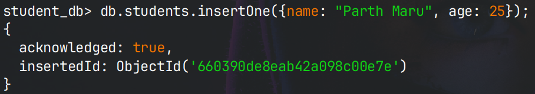
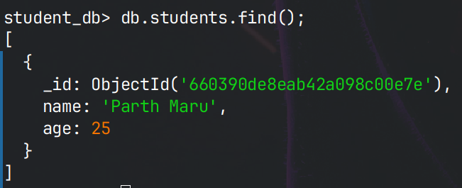

# Show database

```
show dbs;

show databases;
```

# Using a DB

```
use <db_name>;
```

# Create a new DB

```
use student_db;
```
- This command will use `student_db` db if present.
- But if it does not exists, it will create a new db `student_db` and start using it.
- This newly created db will not be displayed in the list of DB unless there is exists any collection in the DB.

# Show collections

```
show collections;
```

# Create a new collections

```
db.createCollection("courses");
db.createCollection("students");
```

- Now when we try to list the existing DB, `student_db` will also show up.

# Display all the documents in a collection

```
db.students.find();
```

# Inserting data in a collection

```
db.courses.insertOne({name: "DSA", type: "theoretical", marks: 100});
```





- A unique id is also generated.
- Every document will have a unique id which is not a incremental id but alphanumeric.